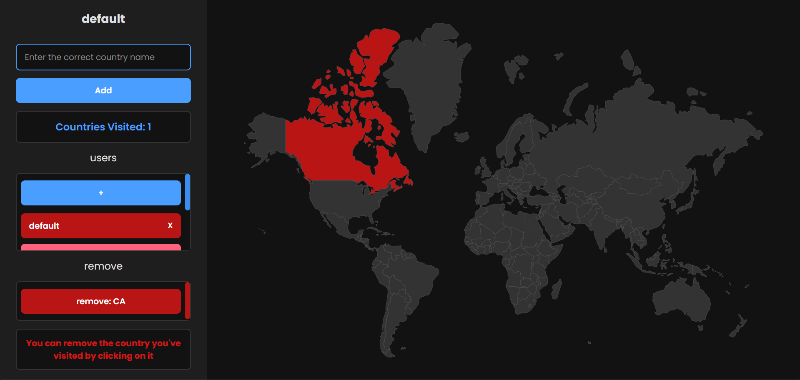

A beautiful and responsive family travel tracker created by Mohammad Hosein Khajeh Mansouri

## Technologies

- HTML
- CSS
- JS
- Node.js
- NPM(express , body-parser)
- EJS
- PostgreSql

## Installation

- Clone the repository
- Install dependencies(npm i)
- Create a database in pgAdmin
- Create tables and relationships in postgres with these code:
```
CREATE TABLE users (
    id SERIAL PRIMARY KEY,
    name VARCHAR(40),
    color VARCHAR(40)
);

CREATE TABLE visited_countries(
    id SERIAL PRIMARY KEY,
    visited_countries VARCHAR(2),
    user_id INTEGER REFERENCES users(id)
);

CREATE table countries(
    id INT NOT NULL,
    country_code VARCHAR(2),
    country_name VARCHAR(40),
)
```
- Import the countries.csv file which is in public folder into the countries table
- change the db code in index.js to your own database code(database , password , port)
- Run the server(node index.js)
- Open the browser and go to localhost:3000
- Enjoy!

## Features

- Add new users
- Add a new countries for each user 
- Delete countries for each user
- Delete a country for each user 
- Change the name of the user
- Delete a user
- See the total number of countries visited for each user
- See the list of users
- See the list of users and their visited countries

## Screenshot


